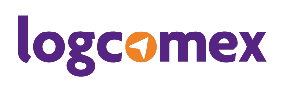

<!-- Badges sessio -->
<p align="center">

  
  
  
  
  
  
  
	
</p>

<p align="center">
	
  

  
  
  
  
  <a target="_blank" rel="noopener noreferrer" href="https://github.com/comexio/design-system/commits/master">
    
  </a>
  
  
    
</p>

</p>

<!--Banner session-->
<h1 align="center">
    
</h1>

<!--Info session-->
<h4 align="center"> 
	🇺🇸 Readme soon avaliable in English 🇺🇸
</h4>

<!-- Index session-->
<p align="center">
 <a href="#-sobre-o-projeto">Sobre</a> •
 <a href="#-como-tudo-funciona">Funcionalidade</a> •
 <a href="#-como-executar-o-projeto">Rodando localmente</a> • 
 <a href="#-docs">Documentação</a> • 
 <a href="#-tecnologias">Tecnologias</a> • 
 <a href="#-licença">Licença</a>
</p>

<!--About session-->
## 💻 Sobre o projeto

Ayla, Design System da [LogComex](https://www.logcomex.com/), foi desenvolvido pensando em facilitar o trabalho da nossa equipe de desenvovedores. Unindo design e agilidade, você poderá criar novos produtos LogComex sem perder tempo e seguindo o padrão dos nossos demais produtos!

Curtiu? Clique [aqui](https://www.npmjs.com/package/@logcomex/design) para acessar o nosso pacote NPM, qualquer um pode testar :) 

---

<!--Functionalities session-->
## ⚙️ Como tudo funciona

O Design System - Ayla, da LogComex, pode ser entendido como uma extensão de componentes do [Vuetify](https://vuetifyjs.com/) adaptados para as necessidades do nosso time, contendo também regras de layout, cores e tipografia da Log. Dessa forma, temos aqui todos os nossos padrões de componentes para que a equipe possa usufruir sem a necessidade de pensar em regras de design e funcionalidades de componentes, maneiro né?

---

<!--Running session-->
## 🚀 Como executar o projeto

### Pré-requisitos

* [Git](https://git-scm.com)
* [Node.js](https://nodejs.org/en/) - v12.x.x (Recomendamos a instalação pelo [NVM](https://github.com/nvm-sh/nvm))
* [Yarn](https://classic.yarnpkg.com/pt-BR/)

### Rodando o projeto

```bash

# Clone o repositório
$ git clone https://github.com/comexio/design-system.git

# Acesse a pasta do projeto do pacote pelo terminal
$ cd design-system/

# Instale as dependências
$ yarn

# Crie um link local do pacote
$ yarn link

# Vá até a pasta do projeto que vai utilizar o pacote
$ cd ..
$ cd projeto-exemplo/

# Faça o link da dependência local do pacote no seu projeto
$ yarn link @logcomex/design-system

# Novamente na pasta do pacote, rode
$ yarn watch

# ou então
$ yarn build

# Por fim, rode o projeto que vai utilizar o pacote
$ yarn dev

```

**Importante**: 

1. Caso opte pelo ```yarn watch``` para assistir as suas alterações, é preciso comentar o import do CSS do Design System no arquivo design.plugin.ts presente no seu projeto.

2. Após terminar de usar o pacote localmente, siga este procedimento:

```bash

# Na raíz do projeto que está usando o pacote localmente, rode
$ yarn unlink @logcomex/design-system

# Na raíz do pacote, rode
$ yarn unlink

# Desta forma você desfaz o link local do pacote, e o projeto volta a referenciar o link do pacote NPM.

# Obs: Se vocẽ estava rodando o pacote com o yarn watch, não esqueça de descomentar o css no design.plugin.ts!

```
---

<!--Docs session-->
## :open_file_folder: Docs
<p align="center">

## LRouteChart

```
  <l-route-chart
    title="Informações de Origem e Destino"
    description="Rotas mais utilizadas para exportação no período pesquisado"
    :header=""
  />
```

### Parâmetros

**header**: Array com os titulos da listagem
```
['Porto de Origem', 'Porto de Descarga', 'Porto de Destino']
```

**lines**: Array de objetos com as linhas da listagem
```
[
  {
    number: '60%',
    quantity: {
      name: 'TEUS',
      value: 22
    },
    values: ['Santos', 'Norfolk', 'Port Everglades']
  },
  {
    number: '20%',
    values: ['Umuarama', 'Bosque Uirapuru', 'Porto do mané']
  },
  {
    number: '20%',
    isLast: true,
    values: 'Outros'
  }
]
```

## LTable

```
  <l-table
    :headers="[{ text: 'Dessert (100g serving)', value: 'name' }]
    :items="[{
      name: 'Frozen Yogurt',
      calories: 159,
      fat: 6.0,
      carbs: 24,
      protein: 4.0,
      iron: '1%',
    }]
  />
```

### Parâmetros
headers e items são iguais aos da tabela do [Vuetify](https://vuetifyjs.com/en/components/data-tables/#data-tables) e todos os atributos deles estão liberados para serem utilizados, nosso componente está fazendo um bind.

### Eventos
**@ordination** e **@updateScroll** estão disponiveis como nosso eventos personalizados

## LBarChart

```
<l-bar-chart
  :data="[{
    title: "Titulo",
    description: "Descrição",
    quantity: "100",
    total: "10.000",
    percentage: 50
  }]"
  color="#D4C5EB"
  description-class="text-right"
  hover-color="#F1E8FF"
  :translation="{"total":"Total","quantity":"Quantidade"}"
  loading="false"
  max-quantity="9"
/>
```

## LButton

```
<l-button
  icon-value="mdi-chevron-left"
  label="Label"
/>
```
### Parâmetros

**icon-value**: String com o icone do MDI

**label**: String com um texto para ser renderizado
  
</p>

---

<!--Tecnologies session-->
## 🛠 Tecnologias

As seguintes ferramentas são usadas na construção do projeto:

-   **[Vue.js](https://vuejs.org/)** - JS Framework
-   **[Vuetify.js](https://vuetifyjs.com/)** - Vue UI Framework
-   **[TypeScript](https://www.typescriptlang.org/)** - JS Superset
-   **[Sass](https://sass-lang.com/)** - CSS Framework

> Dependências do projeto no [package.json](./package.json)

#### **Utilitários**

-   Editor:  **[Visual Studio Code](https://code.visualstudio.com/)**  → Extensions:  **[ESLint](https://marketplace.visualstudio.com/items?itemName=dbaeumer.vscode-eslint)**, **[Prettier](https://marketplace.visualstudio.com/items?itemName=esbenp.prettier-vscode)**, **[Vetur](https://marketplace.visualstudio.com/items?itemName=octref.vetur)**, **[Vuetify-VSCode](https://marketplace.visualstudio.com/items?itemName=vuetifyjs.vuetify-vscode)**
-   Padrão CSS:  **[BEM](http://getbem.com/introduction/)**
-   Markdown:  **[EmojiCopy](https://www.emojicopy.com)**,  **[Markdown Emoji](https://gist.github.com/rxaviers/7360908)**
-   Badges:  **[Shields.io](https://shields.io)**


<!--License session-->
## 📝 Licença

Este projeto está sob a licença [MIT](./LICENSE).

---

<!--Bottom session-->
<h4 align=center>
 	<a target="_blank" rel="noopener noreferrer" href="https://www.logcomex.com/">
    
  </a>
</h4>
